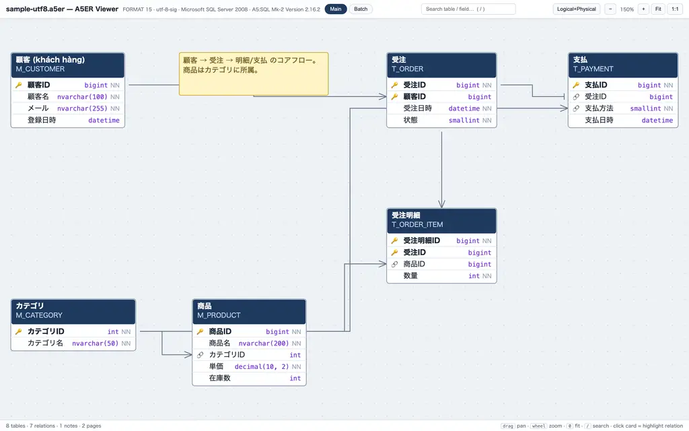

# a5er2html

**[日本語の README はこちら（README.ja.md）](README.ja.md)**

Turn an [A5:SQL Mk-2](https://a5m2.mmatsubara.com/) ER diagram (`.a5er`) into a
single, self-contained **HTML file** that anyone can open in a browser — no
server, no network, no A5:SQL installation, no JavaScript dependencies.

```console
$ python3 -m a5er2html meet_DB.a5er
OK  meet_DB.a5er -> meet_DB.html
    encoding=utf-8  format=21  pages=3  entities=42  relations=57  notes=6
```



## Why

A5:SQL Mk-2 is the de-facto ER-diagram tool in many Japanese projects, but a
`.a5er` file can only be viewed properly with the tool itself. When you need to
share a schema with teammates, reviewers, or offshore partners, you have to
export images or PDFs that go stale immediately.

`a5er2html` generates one portable HTML file per diagram: send it by chat,
attach it to a ticket, or commit it next to the `.a5er` source — the reader
just opens it.

## Features

- **Fully offline output** — the diagram data is embedded as JSON inside the
  HTML file. Nothing is loaded from the network.
- **Encoding auto-detection** — reads the `# A5:ER ENCODING:` declaration and
  handles UTF-8, UTF-8 with BOM, and Shift_JIS (CP932), including old files
  with no declaration at all.
- **Multi-page diagrams** — one tab per A5:ER page.
- **Logical / physical name toggle** — switch between logical names, physical
  names, or both.
- **Live search** — filter tables and fields (logical, physical, type, and
  comment are all searched); non-matching tables dim out.
- **Relation rendering** — orthogonal edges with crow's-foot / one-tick
  cardinality markers, anchored to the actual FK field rows when possible.
- **PK / FK markers** — 🔑 on primary keys, 🔗 on foreign keys.
- **Notes** — `[Note]` sticky notes are rendered on their page.
- **Pan / zoom / fit** — mouse drag, wheel zoom, keyboard shortcuts.
- **Rearrangeable layout** — drag table cards and notes to reorganize the
  page; relation edges re-anchor live. The arrangement is saved in the
  browser (localStorage) and restored on reload; a **Reset layout** button
  returns the original `.a5er` positions. Works without storage too.
- **Zero dependencies** — pure Python standard library; works offline.

## Requirements

- Python **3.9+** (tested up to 3.14; stdlib only — nothing to `pip install`)
- Node.js **20+** when using the JavaScript port in [`node/`](node) — zero npm
  dependencies, nothing to install
- Any modern browser to view the output (Chrome / Edge / Firefox / Safari)

## Installation

### Option A — run from a checkout (no install)

```console
$ git clone https://github.com/OWNER/a5er2html.git
$ cd a5er2html
$ python3 -m a5er2html path/to/input.a5er
```

### Option B — install as a command

```console
$ pipx install .          # inside the clone — recommended
# or
$ pip install .
```

This gives you an `a5er2html` command:

```console
$ a5er2html input.a5er -o docs/schema.html
```

### Option C — Node.js instead of Python

A zero-dependency Node.js port lives in [`node/`](node) for machines that
have Node but no Python:

```console
$ node node/src/cli.js meet_DB.a5er     # run straight from the checkout
# or install it as a command:
$ npm install -g ./node
$ a5er2html input.a5er -o docs/schema.html
```

It produces the same viewer from the same files: identical intermediate
representation, messages, exit codes, and encoding handling; the same flags
as the Python CLI (`-o/--output`, `-h/--help`) plus a Node-conventional
`-v/--version` (the Node test suite cross-checks the IR against the Python
implementation on every fixture and skips that check automatically when
Python is absent).

## Usage

```
a5er2html input.a5er [-o output.html]
```

| Option | Description |
|---|---|
| `input` | source `.a5er` file |
| `-o, --output` | output `.html` path (default: `<input>.html` next to the source) |

The exit code is `0` on success, `1` on I/O errors. If the file contains no
`[Entity]` sections a warning is printed but an (empty) viewer is still
generated.

### Viewer shortcuts

| Key / action | Effect |
|---|---|
| `drag` | pan |
| `wheel` / `+` / `-` | zoom |
| `0` | fit diagram to window |
| `1` | 100% zoom |
| `/` | focus the search box |
| `Esc` | clear search / selection / cancel a drag |
| drag a table card or note | move it — edges follow, `Esc` snaps it back |
| click a table | highlight its relations |
| hover a table header / field / edge | detail tooltip (comment, default, cardinality…) |

## Examples

The [`examples/`](examples/) directory contains small fixture databases used
by the test suite — they double as a usage demo:

| File | What it exercises |
|---|---|
| `sample-utf8.a5er` | UTF-8 with declaration, 2 pages, notes, escaped quotes, commas inside types/comments |
| `sample-sjis.a5er` | same schema saved as Shift_JIS (`ENCODING:SJIS`) |
| `sample-sjis-nodecl.a5er` | Shift_JIS **without** an encoding declaration (fallback sniffing) |
| `sample-edgecases.a5er` | UTF-8 BOM, zero-field entity, entity without page/position, composite PK, multi-line comments/notes, dangling relation, `ManyToMany` / `ManyToOne` / `N:1` cardinality, FORMAT 21 `RelationType` codes, unknown section |
| `sample-empty.a5er` | degenerate file with no entities |
| `sample-utf8.html` | pre-built demo output of `sample-utf8.a5er` — open it right now to see the viewer |

Regenerate the demo: `python3 -m a5er2html examples/sample-utf8.a5er`

## How it works

1. `a5er2html/parser.py` decodes the file (encoding sniffing), splits the
   INI-like sections (`[Manager]`, `[Entity]`, `[Relation]`, `[Note]`), parses
   the quoted-CSV values (`Field=`, `Position=`, `PageInfo=`), and produces a
   JSON-serializable intermediate representation.
2. `a5er2html/cli.py` injects that IR into `a5er2html/viewer_template.html`
   (placeholder `__A5ER_DATA__`). The `<` character is escaped in the JSON
   payload so the file cannot break out of its `<script>` tag.
3. The template is a plain single-file HTML/CSS/JS app that lays out entity
   cards from the A5:ER coordinates, draws orthogonal relation edges, and
   wires up search / tabs / zoom.
4. The Node.js port (`node/src/parser.js`, `node/src/cli.js`) mirrors those
   modules one-to-one and injects the same IR into the same
   `viewer_template.html` (each implementation ships a copy; a CI test keeps
   the two byte-identical).

Supported cardinality inputs: `OneToMany`, `ManyToOne`, `OneToOne`,
`ManyToMany`, ratio strings (`1:N`, `N:1`, `N:N`), and FORMAT ≥ 16
`RelationType1/2` numeric codes (`3` = crow's-foot end). Anything absent or
unrecognized falls back to the common A5:ER default: **1:N with the FK on
Entity2**.

## Limitations

- The viewer is **read-only** — it does not edit or write back `.a5er` files
  (dragged positions live in the viewer/browser only, never in the source).
- Card layout approximates the A5:SQL Mk-2 editor (same coordinates, measured
  text widths); it is not a pixel-perfect clone.
- Sections other than `Manager` / `Entity` / `Relation` / `Note` are ignored
  and only listed in the footer (`skipped:`) of the generated file.
- Physical storage definitions (e.g. table spaces, indexes) are not rendered.

## Development

```console
$ git clone https://github.com/OWNER/a5er2html.git && cd a5er2html
$ python3 -m unittest discover -s tests -v
$ cd node && npm test    # Node.js port — includes a Python-parity check
```

See [CONTRIBUTING.md](CONTRIBUTING.md) for the fixture-based testing workflow.

## License

[MIT](LICENSE). This project is not affiliated with A5:SQL Mk-2 or its author;
it only reads the plain-text `.a5er` file format.
